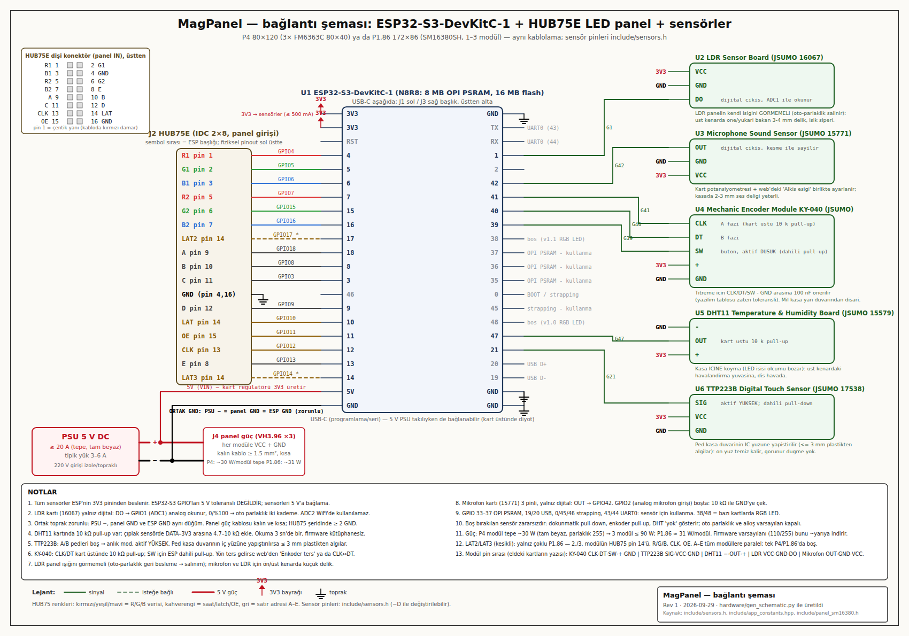

# MagPanel donanım — bağlantı şeması ve sensörler

ESP32-S3-DevKitC-1 + HUB75E LED panel (P4 80×120 ya da P1.86 172×86, 1–3 modül) +
beş JSUMO sensör/kontrol modülü. Şema **koddan üretilir** (`gen_schematic.py`, sadece
stdlib) — kasa gibi (`enclosure/generate_case.py`) parametrik: pin değişince script'i
düzelt, yeniden üret. Pin ataması `include/sensors.h` ve `include/app_constants.hpp`
ile birebir aynı olmalı.



Vektör: [`schematic.svg`](schematic.svg) · Üretici: [`gen_schematic.py`](gen_schematic.py)

## KiCad taşıyıcı kart (şematik + PCB)
Aynı bağlantıların üretilebilir hâli: DevKit soketi, 2× 74HCT245 (DIP-20) seviye dönüştürücü,
3× HUB75E çıkışı (LAT panel başına), 5 V giriş koruması ve sensör başlıkları. KiCad 8
projesi, gerber/BOM/CPL dosyaları ve üretici [`kicad/`](kicad/README.md) klasöründe.


## Pin tablosu (ESP32-S3-DevKitC-1)

### HUB75E (değişmedi — `include/app_constants.hpp`)
| HUB75 pin | İşlev | GPIO | | HUB75 pin | İşlev | GPIO |
|---|---|---|---|---|---|---|
| 1 | R1 | 4 | | 9 | A | 18 |
| 2 | G1 | 5 | | 10 | B | 8 |
| 3 | B1 | 6 | | 11 | C | 3 |
| 4 | GND | GND | | 12 | D | 9 |
| 5 | R2 | 7 | | 13 | CLK (DCLK) | 12 |
| 6 | G2 | 15 | | 14 | LAT (LE) | 10 |
| 7 | B2 | 16 | | 15 | OE (P4: GCLK) | 11 |
| 8 | E | 13 | | 16 | GND | GND |

Çoklu P1.86 (2–3 modül, `include/panel_sm16380.h`): tüm modüller R/G/B, CLK, OE, A–E
hattını paylaşır; **2. modülün LAT'ı GPIO17, 3. modülün LAT'ı GPIO14** (şemada kesikli).

### Sensörler (`include/sensors.h`; `-DSENS_PIN_*` ile değiştirilebilir)
| Modül (JSUMO kodu) | Modül pini | GPIO | Mod | Not |
|---|---|---|---|---|
| LDR Sensor Board (16067) | DO | **1** (ADC1_CH0) | analog okuma | kart yalnız dijital: oto parlaklık iki kademe |
| Microphone Sound Sensor (15771) | OUT | **42** | giriş, pull-up | kart yalnız dijital: kesme sayımı, VU + çift alkış |
| (analog mikrofon girişi) | — | **2** (ADC1_CH1) | analog | eldeki kartta yok; boşta kalmasın (taşıyıcıda R7 10 kΩ GND) |
| Mechanic Encoder Module KY-040 | CLK (A) | **41** | giriş, pull-up | kesme, tam-adım tablo |
| KY-040 | DT (B) | **40** | giriş, pull-up | |
| KY-040 | SW | **39** | giriş, pull-up | aktif düşük; kısa/uzun basma |
| DHT11 Temperature & Humidity Board (15579) | OUT | **47** | open-drain + pull-up | 3 sn'de bir okuma |
| TTP223B Digital Touch Sensor (17538) | SIG | **21** | giriş, pull-down | aktif yüksek, anlık mod |
| hepsi | VCC / + | **3V3** | | 5 V'a BAĞLAMA (GPIO 5 V toleranslı değil) |
| hepsi | GND / − | GND | | |

Eldeki modüllerin pin sırası (kart baskısı, 2026-10-02 fotoğrafları): LDR **VCC GND DO**,
mikrofon **OUT GND VCC**, KY-040 **CLK DT SW + GND**, DHT11 **− OUT +**, TTP223B **SIG VCC GND**.
KiCad taşıyıcı kartındaki başlıklar aynı sırada; düz kablo çaprazlamaz.

**Neden bu pinler:** HUB75 ESP'nin sol başlığını (3–18) kullanır; sensörlerin hepsi sağ
başlığa düşer → şemada kablolar çaprazlaşmaz, kablolama kolay. Analog girişler zorunlu
olarak ADC1'de (GPIO1–10; ADC2 = GPIO11–20 WiFi açıkken okunamaz). Kullanılmayanlar:
19/20 USB, 33–37 OPI PSRAM, 0/45/46 strapping, 43/44 UART0, 38/48 devkit RGB LED'i.

## Güç
| | |
|---|---|
| PSU | 5 V DC, tepe için ≥ 20 A (P4 modül tam beyaz ~30 W ×3; P1.86 ≈ 31 W/modül). Tipik yük 3–6 A. |
| Panel | J4: her modüle VCC+GND, ≥ 1.5 mm² kısa kablo. HUB75 şeridinde en az 2 GND (pin 4 + 16). |
| ESP32 | PSU +5 V → devkit **5V** pini (VIN); kart regülatörü 3V3 üretir (sensörler ≤ 500 mA bütçesinde). USB aynı anda takılı olabilir (kart diyotlu). |
| Toprak | PSU −, panel GND ve ESP GND **aynı düğüm** (ortak GND şart; `BULGULAR.md`). |

Firmware varsayılan parlaklığı (110/255) tepe gücü kabaca yarıya indirir; oto parlaklık
karanlıkta daha da düşürür.

## Modül notları
- **TTP223B:** A/B pedleri boş → anlık mod, aktif YÜKSEK. Ped **kasa duvarının iç yüzüne**
  yapıştırılırsa ≤ 3 mm plastikten algılar; ön yüz temiz kalır (görünür düğme yok).
  Firmware GPIO21'i pull-down tutar → modül takılı değilken sahte tetik yok.
- **DHT11 kartı:** üzerinde 10 kΩ pull-up var; çıplak sensörde DATA–3V3 arasına 4.7–10 kΩ.
  Kasa **içine** koyma: LED paneli ısınır, oda sıcaklığı yanlış çıkar → üst kenardaki
  havalandırma yuvasına, dış havada. DHT22/AM2302 takılırsa `-DSENS_DHT22=1`.
- **KY-040:** CLK/DT kart üstünde 10 kΩ pull-up; SW için ESP dahili pull-up. Titreme için
  CLK/DT/SW–GND 100 nF önerilir (yazılım tablosu zaten sıçrama toleranslı; KiCad
  taşıyıcı kartında C5–C7 olarak var). Yön ters
  gelirse web'den "Enkoder ters" ya da CLK↔DT değiştir. Mil kasa yan duvarından dışarı,
  düğme takılır.
- **LDR kartı:** panelin **kendi ışığını görmemeli** (geri besleme → oto parlaklık salınımı):
  üst kenarda öne/yukarı bakan 3–4 mm delik + küçük ışık siperi. Eldeki kart 3 pinli ve
  yalnız karşılaştırıcı çıkışı (DO) veriyor: firmware GPIO1'i okur, sonuç 0 ya da %100 olur.
  Oto parlaklık böylece iki kademe çalışır; geçiş eşiği kart üstündeki trimpotla ayarlanır.
  Aydınlıkta parlaklık düşüyorsa web'den "LDR ters" işaretle. Kademesiz ayar için AO'lu
  (4 pinli) LDR kartı ya da çıplak LDR + 10 kΩ bölücü GPIO1'e bağlanmalı.
- **Mikrofon kartı:** eldeki kart 3 pinli (OUT, GND, VCC) ve yalnız dijital: OUT → GPIO42.
  Firmware DO tetiklerini "yüksek ses" sayar; VU göstergesi açık/kapalı çalışır.
  GPIO2 (analog mikrofon girişi) boşta kalırsa gürültü okur: taşıyıcı kartta R7 (10 kΩ) GND'ye çeker.
  Kart potansiyometresi + web'deki "Alkış eşiği" birlikte ayarlanır (ses çubuğu alkışta
  eşik çizgisini geçmeli, konuşmada geçmemeli). Kasada 2–3 mm ses deliği yeter.

## Kasa yerleşimi (enclosure/ ile uyum)
Kapalı difüzör ön yüz korunur; hiçbir sensör önden görünmez:
- **Üst kenar:** LDR deliği (öne bakan), mikrofon deliği, DHT11 havalandırma yuvası
  (mevcut kablo çıkışının yanı). `generate_case.py`'ye üst duvara üç delik + bir yuva
  eklemek yeterli (henüz eklenmedi — bkz. açık sorular).
- **Yan kenar:** enkoder mili (7 mm delik + somun), dokunmatik ped iç yüzde (işaret için
  dışa küçük bir kabartma/sticker).
- Modüller ESP'ye kısa (≤ 30 cm) jumper ile; DHT11 ve LDR için 3 damar, enkoder 5 damar.

## Yazılım tarafı (özet — ayrıntı `CLAUDE.md`)
- `include/sensor_logic.h`: saf C++ durum makineleri (enkoder tablosu, DHT çözme, alkış,
  buton, oto parlaklık) — `tools/test_sensor_logic.cpp` ile host'ta test edilir.
- `include/sensors.h`: pinler, kesmeler, bloklamayan DHT okuma, NVS `sensors`.
- Web UI "Sensörler & kontroller" kartı: canlı değerler, oto parlaklık, eylem eşlemeleri
  (enkoder bas / uzun bas / dokunmatik / çift alkış → uyku, sonraki uygulama, sonraki galeri,
  oto parlaklık), alkış eşiği, uyku düğmesi. WS `0x11` ayar, `0x12` uyku; `"S:"` 1 Hz
  telemetri, `"C:"` ayar, `"B:"` parlaklık; HTTP `/api/sensors`.
- Yeni uygulamalar: **Oda** (sıcaklık/nem/ışık/saat), **Ses** (VU geçmişi). Hava
  uygulamasına iç mekan satırı eklendi.

## Yeniden üretmek
```bash
python3 hardware/gen_schematic.py                     # schematic.svg (kesişim kontrolü yapar)
# PNG (Chromium headless; herhangi bir SVG→PNG aracı da olur):
chromium --headless=new --hide-scrollbars --window-size=1700,1400 \
  --screenshot=/tmp/s.png file://$PWD/hardware/schematic.svg
python3 -c "from PIL import Image; Image.open('/tmp/s.png').crop((0,0,1700,1190)).save('hardware/schematic.png')"
```

## Açık sorular / doğrulanacaklar
1. LDR yönü (ışıkta artan mı azalan mı) → web'de "LDR ters".
2. Kademesiz oto parlaklık istenirse AO'lu LDR kartı ya da çıplak LDR gerekir (eldeki kart dijital).
3. Kasaya sensör delikleri eklenecek mi (generate_case.py)?
4. Enkoder/dokunmatik varsayılan eylemleri: basma = uyku/uyan, uzun basma = sonraki
   uygulama, dokunmatik = uyku/uyan, çift alkış = kapalı. Web'den değiştirilebilir.
