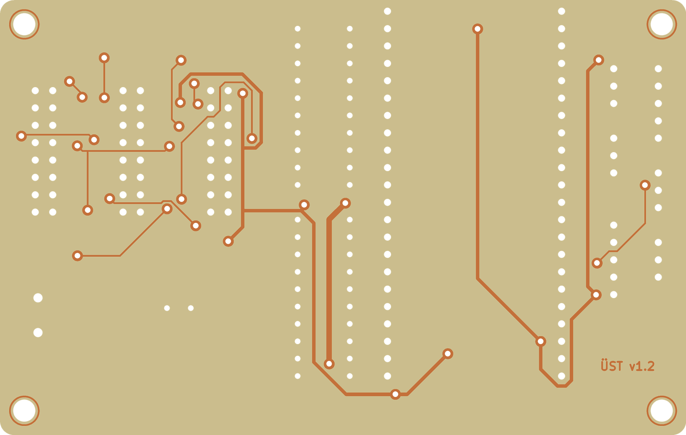

# Ev yapımı çift yüz kart: Elegoo Saturn 3 + negatif dry film

Aynı şematiğin evde yapılacak sürümü. Kart çizimi ayrı bir KiCad projesidir
(`magpanel-carrier-diy/`), çıktılar `fab-diy/` altındadır. Hepsi `gen_carrier.py --diy` ile
üretilir, fabrika kartının dosyalarına dokunmaz. Pozlama dosyaları Saturn 3 ve Saturn 3 Ultra
içindir (12K ekran, 11520 × 5120 piksel).

Tek yüz plaketle de yapılır: aynı alt bakır, üst katman yerine bakır yüzde 19 tel. Bkz.
[Tek yüz sürüm](#tek-yüz-sürüm).



## Fabrika kartından farkı
| | Fabrika kartı (`fab/`) | Ev yapımı kart (`fab-diy/`) |
|---|---|---|
| Delik kaplaması | var | yok, her via'ya tel |
| Delikli parça pedleri | iki yüzde | yalnız altta, lehim alttan |
| SMD parçalar | üstte | altta |
| Üst katman | sinyal ve GND | yalnız via'lar arası köprü izleri |
| Sinyal izi / boşluk | 0.25 / 0.2 mm | 0.25 / 0.2 mm |
| Güç ve GND | 0.5–1.0 mm | 0.5–1.0 mm, boşluk 0.3 mm |
| Via | 0.6 / 0.3 mm | 1.6 / 0.8 mm, 33 adet |
| GND dökümü | iki yüzde | yalnız altta |
| Lehim maskesi, serigrafi | var | yok, montaj için 1:1 çizim |

Delikler kaplamasız olduğu için soket ve başlık pinleri yalnız alttan lehimlenir. Bu yüzden
delikli pedlerin bakırı sadece alttadır. Üst katmandaki izler iki via arasında köprü kurar,
parça pinine dokunmaz. Her via bir tel parçasıdır ve iki yüzden lehimlenir.

Üç HUB75 başlığı aynı yönde yan yana durur. Ortak hatlar başlık pinlerinin arasından geçmek
zorundadır, via'ların çoğu bu bölgededir. 0.3 mm iz ve 0.25 mm boşlukla aynı kart 40–45 via
istiyordu. Üst katmanda montaj deliklerinin çevresinde hizalama halkaları ve köşede "ÜST v1.2",
altta "ALT v1.2" yazısı var. Yazılar pozlamanın yönünü doğrular.

## Dosyalar
| Dosya | İçerik |
|---|---|
| `fab-diy/saturn3/*.goo` | yazıcıya hazır pozlama dosyaları, tablo 1. adımda |
| `fab-diy/magpanel-carrier-diy-gerber.zip` | gerber ve delik dosyaları, tablo aşağıda |
| `fab-diy/magpanel-carrier-diy-assembly-bottom.pdf` | alt yüz 1:1, alttan bakış: SMD'ler ve izler |
| `fab-diy/magpanel-carrier-diy-assembly-top.pdf` | üst yüz 1:1: delikli parçalar, köprü izleri, via'lar |
| `fab-diy/magpanel-carrier-diy-bom.csv` | malzeme listesi |
| `img/diy-top.png`, `img/diy-bottom.png` | görseller |

Zip içindekiler:
| Dosya | Ne için |
|---|---|
| `…-B_Cu.gbl` | alt bakır |
| `…-F_Cu.gtl` | üst bakır |
| `…-Edge_Cuts.gko` | kart dış hattı. UVtools kartın yerini bundan bulur, ışık vermez |
| `…-Hizalama.gbr` | hizalama çerçevesi: kart kenarından 0.5 mm dışarıda 3 mm ışıklı bant |
| `…-PTH.drl`, `…-NPTH.drl` | delikler. PTH.drl pozlamada pedlere matkap merkez noktası da koyar |
| `…-B_Mask.gbs`, `…-F_Mask.gts` | isteğe bağlı UV lehim maskesi |

## Malzemeler
| Malzeme | Not |
|---|---|
| Çift yüz bakır plaket | FR4 1.6 mm, 35 µm |
| Negatif dry film | mavi fotorezist film, iki yüz için |
| Laminatör ya da ütü | 100–110 °C |
| Sodyum karbonat (çamaşır sodası) | banyo: litrede 10 g, 25–30 °C |
| Sodyum persülfat ya da demir 3 klorür | aşındırma |
| Sodyum hidroksit (kostik) | film sökme: litrede 30–50 g |
| Matkap uçları | tablodaki çaplar, matkap standı |
| Via teli | 0.6 mm kalaylı bakır tel ya da kesilmiş direnç bacağı |
| Koruma | UV gözlük, eldiven, plastik kaplar |

Delikler:
| Çap | Adet | Nerede |
|---|---|---|
| 0.8 mm | 75 | 33 via, iki DIP soket, C1 |
| 1.0 mm | 114 | DevKit soketleri, HUB75 başlıkları, sensör başlıkları |
| 1.3 mm | 2 | klemens J1 |
| 3.2 mm | 4 | montaj delikleri |

## 1. Pozlama dosyaları
`fab-diy/saturn3/` içindeki dosyalar USB belleğe kopyalanıp doğrudan basılır.

| Dosya | Ne yapar | Süre |
|---|---|---|
| `pozlama-testi.goo` | 6 şerit, şerit başına 10 s birikir: 10, 20 … 60 s | 6 × 10 s |
| `cerceve.goo` | yalnız hizalama çerçevesi: kartı yerleştirmek için | 120 s |
| `alt.goo` | alt bakır + çerçeve + pedlerde matkap merkez noktası | 30 s, yer tutucu |
| `ust.goo` | üst bakır, aynalı + çerçeve | 30 s, yer tutucu |

Testten sonra `alt.goo` ve `ust.goo`'nun süresini değiştir: [UVtools](https://github.com/sn4k3/UVtools)'ta
dosyayı aç, **Tools → Edit print parameters**, Bottom exposure time ve Exposure time'ı test
süresine getir, kaydet. UVtools komut satırı kuruluysa dosyalar yeniden de üretilebilir:
`DIY_EXPOSURE=25 $PY gen_carrier.py --diy fab`.

**Kendi dosyanı yapmak istersen** ya da yazıcı dosyayı açmazsa: Chitubox ya da Lychee'de Saturn 3
için küçük bir küp dilimle, `.goo` olarak kaydet, UVtools 7'de aç ve **Tools → PCB exposure**
aracını seç. Araç dosyanın katmanlarını silip pozlama görüntüsünü koyar.

| Kaydet | Eklenecek dosyalar | Mirror |
|---|---|---|
| `cerceve.goo` | Edge_Cuts.gko, Hizalama.gbr | kapalı |
| `alt.goo` | Edge_Cuts.gko, B_Cu.gbl, Hizalama.gbr, PTH.drl | kapalı |
| `ust.goo` | Edge_Cuts.gko, F_Cu.gtl, Hizalama.gbr | açık |

| Ayar | Değer | Neden |
|---|---|---|
| Merge files into a single layer | açık | bakır, çerçeve ve delik noktaları tek pozlamada |
| Invert color | kapalı | negatif film: ışık alan yer sertleşir, altındaki bakır kalır |
| Anchor | Middle center | kart ekranın ortasına gelir, ışık orada en düzgün |
| Offset X / Y | 0 | |
| Exposure time | test süresi, `cerceve.goo` için 120 s | |
| Flip vertically | açık | varsayılan |
| Enable anti-aliasing | kapalı | |
| PTH.drl satırı | Size scale 0.4, Invert polarity işaretsiz | UVtools delikleri zaten karanlık çizer: pedin ortasında bakırsız nokta kalır |
| Edge_Cuts.gko satırı | board outline işaretli | `.gko` uzantısını kendisi tanır. Kartın yeri bu dosyadan hesaplanır |

Çerçeve simetriktir. Mirror görüntüyü çerçevenin, yani kartın tam ortasından aynalar. Bu ayarlarla
üç dosyada çerçeve aynı yere, ekranın ortasına düşer: UVtools 7.0.1 komut satırıyla üretilip
ölçüldü.

## 2. Kâğıtla prova
Hazneyi ve tablayı çıkar. Ekrana beyaz kâğıt koy, dosyayı başlat, telefon kamerasıyla yukarıdan
bak. 405 nm ışığa çıplak gözle uzun bakma.
- Çerçevenin tamamı ekranda görünmeli.
- `alt.goo`'da "ALT v1.2", `ust.goo`'da "ÜST v1.2" yazısı **ters** görünmeli. Bakır yüz ekrana
  bakar, yukarıdan kartın sırtını görürsün. Bir dosyada yazı düz görünüyorsa o dosyanın Mirror
  ayarını değiştir.
- İki yazı çerçevenin aynı köşesinde olmalı. Öyleyse kart 5. adımda sağdan sola çevrilir.
  Farklı köşelerdeyse yazıcı dikey aynalıyor: kartı çevirirken ön ve arka kenar yer değiştirsin.
- Yazıcı başlarken kolunu aşağı indirir. Tabla takılı değilken kol ekrana inmez, ama kolun nereye
  kadar indiğine bu provada bak. Kartın üstüne koyacağın ağırlık ondan alçak olsun.

## 3. Pozlama süresi testi
Filmin hassasiyeti markadan markaya değişir. `pozlama-testi.goo` altı süreyi tek seferde dener.
1. Yaklaşık 100 × 28 mm'lik bir plaket şeridine film lamine et (4. adımdaki gibi).
2. Dosyayı başlat, şeridi film yüzü aşağıda çerçevenin ortasına koy, üstüne cam ve ağırlık.
   Altı şeridin tamamı plaketin altında kalmalı (96 × 24 mm).
3. Banyo et (6. adım). Etiketler film yüzünde düz okunur, yukarıdan bakınca terstir.
4. Doğru süre: film kalkmayan şeritler içinde 0.2 mm çizgi aralıkları açık kalan ve pedlerin
   arasından geçen iz pedlere değmeyen en kısa süre. Uzun süre aralıkları kapatır, kısa süre
   filmi banyoda kaldırır.

## 4. Kartı hazırla
1. Plaketi 100.0 × 63.5 mm kes. Kenarları zımparala: çapak ekranı çizer.
2. Bakırı ince bulaşık teli ve deterjanla parlayana kadar temizle, durula, kurula.
   Parmak izi bırakma.
3. Sarı ışıkta ya da loş odada iki yüze film lamine et. Filmin yumuşak iç koruyucusunu soy,
   sert dış koruyucu üstte kalsın. Kabarcık bırakma.
4. Kartın bir uzun kenarının kalınlık yüzüne keçeli kalemle çizgi çek. Bu ön kenardır, iki
   pozlamada da yazıcının önüne bakar.

## 5. Hizala ve pozla
1. Hazne ve tabla takılı değil. Ekranı alkolle sil.
2. `cerceve.goo`'yu başlat. Kartı film yüzü aşağıda, ön kenarı öne bakacak şekilde çerçevenin
   içine koy. Dört kenarda da eşit, ince karanlık boşluk kalsın (0.5 mm). Telefonla yakından bak.
3. Üstüne düz bir cam ve hafif bir ağırlık koy. Kart ekrana tam otursun ve kaymasın.
4. Çerçeve dosyasını durdur. Kartı oynatmadan `alt.goo`'yu başlat ve bitmesini bekle.
5. Kartı kitap sayfası çevirir gibi çevir: sol ve sağ kenar yer değiştirir, ön kenar yine önde.
6. `cerceve.goo` ile yeniden ortala, sonra `ust.goo`.

Sağ ve sol boşluğun eşitliği önemlidir. Çevirme yüzünden sağ-sol kayma iki yüz arasında iki
katına çıkar: 0.1 mm kayma via'larda 0.2 mm kaçıklık yapar. Via halkası 0.4 mm, buna dayanır.
Ön-arka kayma iki yüzü birlikte kaydırır, hizalamayı bozmaz.

## 6. Banyo, aşındırma, film sökme
1. Pozlamadan sonra 15 dakika beklet. İki yüzün dış koruyucusunu soy.
2. Banyo: litrede 10 g sodyum karbonat, 25–30 °C. Yumuşak fırçayla 1–3 dakika. Işık almamış film
   erir, altındaki bakır parlar. Bol suyla durula.
3. Kontrol: iki yazı da kendi yüzünde düz okunmalı. Kopuk izi asetat kalemiyle tamamla,
   köprüyü maket bıçağıyla kazı.
4. Aşındır: sodyum persülfat 40–50 °C'de 10–20 dakika, kabı salla. İki yüz birlikte aşınır.
5. Filmi sök: sodyum hidroksit çözeltisinde 1–2 dakika, sonra durula.
6. Bakır çabuk kararır. Hemen lehimlenmeyecekse kimyasal kalay ya da ince lak sür.

## 7. Delme
- Alt yüzden, pedlerin ortasından del. Merkez noktaları ucu ortalar.
- Önce bütün delikleri 0.8 mm ile aç, sonra büyükleri büyüt. Kayma azalır.
- Montaj delikleri hizalama halkalarının tam ortasındadır.

## 8. Via telleri ve montaj
1. **Via telleri ilk iş.** Teli geçir, iki yüzden lehimle, iki yüzde de dibinden kes. 12 via
   HUB75 başlıklarının, biri U3 soketinin altında kalır. Üstteki lehimi yassı bırak, başlık düz
   otursun.
2. **SMD'ler alt yüze.** `assembly-bottom.pdf` alttan bakıştır. D1 ve D2'nin katot bandı
   çizimdeki kapalı uca gelir.
3. **Delikli parçalar** üstten takılır, alttan lehimlenir: DIP soketler, sensör başlıkları,
   HUB75 başlıkları, klemens, C1. DevKit soketleri en son.
4. **Ölçüm.** Her via'nın iki pedi arasında süreklilik olmalı. HUB75 başlıklarında komşu pinler
   arasında kısa devre olmamalı. Sonra [README](README.md)'deki ilk açılış adımları.

## Tek yüz sürüm
Aynı kart tek yüz plaketle: yalnız alt bakır pozlanır, üst katmandaki 13 köprü bakır yüzde 19
yalıtımlı tele dönüşür. İkinci pozlama, kartı çevirme ve iki yüzü hizalama yok.


| | Çift yüz | Tek yüz |
|---|---|---|
| Plaket | çift yüz | tek yüz, 1.6 mm |
| Pozlama | 2, kartı çevirerek | 1 |
| Üst katman | 373 mm bakır iz | yok |
| Tel | 33 via teli, iki yüzden lehim | 19 köprü teli, bakır yüzde, toplam 550 mm |
| Dosyalar | `fab-diy/` | `fab-diy/` bakır ve pozlama, `fab-ss/` tel listesi |

| Dosya | İçerik |
|---|---|
| `fab-diy/saturn3/pozlama-testi.goo`, `cerceve.goo`, `alt.goo` | pozlama. `ust.goo` kullanılmaz |
| `fab-ss/magpanel-carrier-ss-teller.pdf` | A4, %100 ölçek: alttan bakış tel haritası, HUB75 bölgesi 2 kat büyük, tel listesi |
| `fab-ss/magpanel-carrier-ss-teller.csv` | tel listesi: uçların koordinatı (alttan bakış, sol-alt köşeden), düz mesafe, kesim boyu |
| `img/ss-bottom.png` | tel haritası görseli |

Telleri KiCad'in bağlantı denetimi doğruluyor: üst bakır silinince 19 bağlantı kopuk kalıyor, teller
eklenince 0. Alttan zaten bağlı iki pedi birleştiren tel listeye girmiyor.

**Yapım.** 1, 2 ve 3. adımlar aynı. Kâğıtla provada yalnız "ALT v1.2" yazısına bak, ters
görünmeli. 4. adımda tek yüzü lamine et. 5. adımda kartı çerçevenin ortasına koy ve yalnız
`alt.goo`'yu bas, çevirme yok. 6 ve 7. adımlar aynı. Via deliklerini delmek isteğe bağlı:
delersen telin ucunu deliğe sokup lehimlemek daha sağlam olur.

**Montaj sırası:**
1. SMD'ler, bakır yüze.
2. Delikli parçalar: üstten takılır, alttan lehimlenir. DevKit soketleri en son.
3. Teller, bakır yüzde. Haritadaki çizgi yalnız hangi iki via pedinin bağlanacağını gösterir.
   Teli lehim noktalarının üstünden geçirmeden istediğin yoldan götür, gerekirse bir damla
   yapıştırıcıyla sabitle. İletkeni 0.5–0.6 mm olan yalıtımlı tek damarlı tel kullan.
4. Ölçüm: her telin iki ucu arasında süreklilik olmalı, HUB75 başlıklarında komşu pinler
   arasında kısa devre olmamalı.

Kesim boyu düz mesafenin 1.3 katı artı iki uç için 10 mm, 5 mm'ye yuvarlanmış:

| Tel | Net | Kesim |
|---|---|---|
| W1 | DHT_DATA | 30 mm |
| W2 | +3V3 | 55 mm |
| W3 | +3V3 | 25 mm |
| W4 | +3V3 | 35 mm |
| W5 | GND | 25 mm |
| W6 | +5V | 45 mm |
| W7 | GND | 35 mm |
| W8 | GND | 30 mm |
| W9 | HUB_LAT2 | 30 mm |
| W10 | GND | 25 mm |
| W11 | HUB_B1 | 15 mm |
| W12 | HUB_R2 | 25 mm |
| W13 | HUB_LAT | 30 mm |
| W14 | HUB_ADDR_E | 30 mm |
| W15 | HUB_OE | 30 mm |
| W16 | HUB_R1 | 20 mm |
| W17 | HUB_ADDR_E | 25 mm |
| W18 | HUB_G1 | 15 mm |
| W19 | HUB_B2 | 25 mm |

Bileşen yüzünden geçen klasik tel köprüler de denendi. Tel parça gövdesinin altından geçemez ve
üç HUB75 başlığının gövdeleri arasında yalnız 3.8 mm kalıyor. Freerouting bu kısıtla kartı
tamamlayamadı, bu yüzden teller bakır yüzde.

## İsteğe bağlı: UV lehim maskesi
Delmeden önce alt yüze UV lehim maskesi sür. UVtools'ta Edge_Cuts.gko ve B_Mask.gbs ile yeni dosya
yap: **Invert color açık**, Invert area "Inside the board outline only". Ped açıklıkları karanlık
kalır, gerisi sertleşir. Pozlamadan sonra sertleşmeyen maskeyi alkolle sil.

## Yeniden üretmek
```bash
cd hardware/kicad
$PY gen_carrier.py --diy sch     # aynı şematik, ayrı proje
$PY gen_carrier.py --diy pcb     # SMD'ler alta, delikli pedler yalnız altta, üstte delik yasakları
$PY gen_carrier.py --diy route   # 6 deneme, DRC temiz olanlardan en az vialı kalır
$PY gen_carrier.py --diy fab     # gerber + çerçeve + delik + montaj çizimleri + .goo + görseller
$PY gen_carrier.py --ss fab      # tek yüz: tel listesi + A4 tel haritası (aynı DIY kartından)
```

- `fab` aşaması ERC/DRC sıfır değilse durur. Ayrıca iki bakır katmanın sınır kutusunun kartın
  tam ortasında olduğunu denetler: çerçeve eklenmese de aynalama ekseni kartın ortasında kalır.
- `.goo` dosyaları için UVtools 7 komut satırı gerekir (`UVtoolsCmd`, PATH'te ya da
  `UVTOOLS_CMD=/yol`). Yoksa bu adım atlanır, gerber'ler yine üretilir.
- Freerouting 2.1.0 komut satırında geçiş sınırını uygulamıyor. Bu yüzden her çalıştırmaya süre
  sınırı verilir (4 dakika, tamamlama turu 2 dakika). Takılan deneme elenir.
