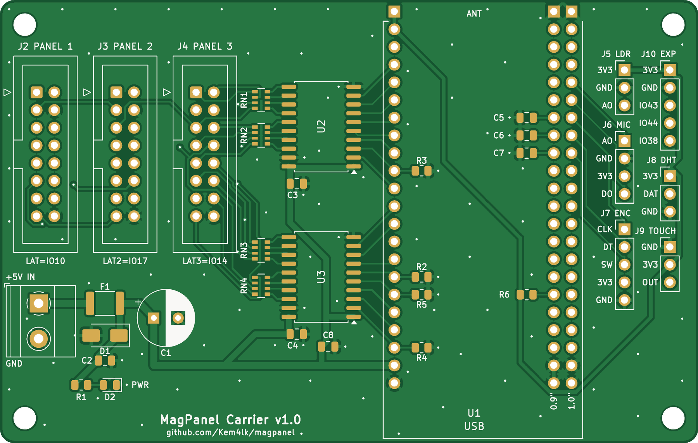

# MagPanel Carrier — KiCad 8 şematik + PCB

ESP32-S3-DevKitC-1'i soketle taşıyan, üç HUB75E çıkışı (P4 tek panel ya da P1.86 1–3 modül)
ve beş JSUMO sensör başlığı olan iki katmanlı taşıyıcı kart. Kasa (`enclosure/generate_case.py`)
ve bağlantı şeması (`hardware/gen_schematic.py`) gibi her şey **koddan üretilir**:
[`gen_carrier.py`](gen_carrier.py). Pin, parça ya da yerleşim değişirse dosyanın başındaki
tabloları düzelt ve yeniden üret. KiCad'de elle yapılan değişiklik bir sonraki üretimde kaybolur.



| | |
|---|---|
| Kart | 100 × 63.5 mm, 2 katman, 1.6 mm FR4, köşelerde 4× M3 |
| İz genişliği | sinyal 0.25 mm, 3V3 0.5 mm, 5 V / VIN 0.8–1.0 mm |
| Kurallar | boşluk ≥ 0.15 mm, via 0.6/0.3 mm, kenar 0.3 mm (JLCPCB standart 2 katman) |
| El lehimi | en küçük parça 0805, el lehimi pedleri, parçalar arası ≥ 0.5 mm (DRC kuralı) |
| GND | iki katmanda döküm + dikiş via'ları |
| Doğrulama | ERC 0, DRC 0 ihlal, 0 bağlanmamış, şematik↔PCB farkı 0 |

Doğrulama satırı `fab` aşamasında her seferinde yeniden kontrol edilir. Biri sıfır değilse
gerber üretilmez.

**Evde yapmak için** iki sürüm var, ikisi de Elegoo Saturn 3 ile negatif dry film pozlanır ve
yazıcıya hazır `.goo` dosyalarıyla gelir:
- Tek yüz, 150 × 100 mm: yalnız alt bakır, tek pozlama, bakır yüzde 3 tel. DevKit pin adları
  soket sıralarının iç tarafında bakırda yazılı. Anlatım: [`TEK-YUZ.md`](TEK-YUZ.md).
- Çift yüz, 100 × 63.5 mm: kaplamasız delik, SMD'ler altta, 33 telli via. Anlatım:
  [`DIY.md`](DIY.md).

## Dosyalar
| Yol | İçerik |
|---|---|
| `magpanel-carrier/` | KiCad 8 projesi: `.kicad_pro`, `.kicad_sch`, `.kicad_pcb`, `.kicad_dru` |
| `magpanel-carrier/MagPanel.kicad_sym`, `MagPanel.pretty/` | DevKit sembolü ve soket footprint'i |
| `fab/magpanel-carrier-gerber.zip` | gerber + delik dosyaları (doğrudan yüklenir) |
| `fab/magpanel-carrier-bom.csv` | tam malzeme listesi |
| `fab/magpanel-carrier-jlc-bom.csv`, `fab/magpanel-carrier-jlc-cpl.csv` | JLCPCB SMT montajı (yalnız SMD, LCSC numaralı) |
| `fab/magpanel-carrier-robotistan-bom.xlsx`, `fab/magpanel-carrier-robotistan-pnp.xlsx` | Robotistan SMT montajı (yalnız SMD, LCSC numaralı) |
| `fab/magpanel-carrier-bomlist.xlsx` | Türkçe BOM şablonu: Fabrika Kodu, Açıklama, Designatör, Malzeme Kılıfı, Adet (yalnız SMD) |
| `fab/magpanel-carrier-schematic.pdf` | şematik (A3) |
| `fab/magpanel-carrier-1to1.pdf` | 1:1 yerleşim testi (A4, ölçek çubuklu) |
| `magpanel-carrier-ss/`, `fab-ss/` | ev yapımı tek yüz sürüm, 150 × 100 mm, bkz. [`TEK-YUZ.md`](TEK-YUZ.md) |
| `magpanel-carrier-diy/`, `fab-diy/` | ev yapımı çift yüz sürüm, bkz. [`DIY.md`](DIY.md) |
| `img/` | şematik ve kart görselleri |

Şematik: [`img/schematic.png`](img/schematic.png) · Alt yüz: [`img/pcb-bottom.png`](img/pcb-bottom.png)

## Devre
1. **5 V giriş ve koruma.** Vida klemensi J1, 1.5 A PTC sigorta F1 ve SMAJ5.0A TVS D1'den
   geçer. Ters kutupta D1 iletir ve F1 açar. Ardından 470 µF + 10 µF ile DevKit'in **5V**
   pinine ve tamponlara gider. Panel gücü bu karttan geçmez: PSU'dan panele kalın kablo.
   Kartın kendi tüketimi 1 A'in altındadır.
2. **DevKit soketi U1.** İki adet 1×22 dişi soket. Sağ sıra 1.0" (25.40 mm) uzakta: eldeki
   N16R8 klonu (2× USB-C) 1:1 baskı testinde bu sıraya oturdu. Resmi Espressif kartı 0.9"
   (22.86 mm) kullanır; onun için `DEVKIT_RIGHT_ROWS` değiştirilip yeniden üretilir. Anten
   kartın üst kenarından dışarı taşar, USB alt kenardadır.
3. **Seviye dönüştürücü.** İki CD74HCT245E (DIP-20, soketli), 3.3 V mantığı 5 V'a çevirir
   (DIR = 5 V, /OE = GND). HCT girişleri TTL eşiklidir, 3.3 V yüksek seviyeyi 5 V beslemede
   güvenle okur; düz 74HC245 bu iş için uygun değildir. A pinleri DevKit pinleriyle aynı
   2.54 mm adımda, bir iki satır kayarak kısa ve kesişmeyen izlerle bağlanır.
   LAT, LAT2, LAT3 ve OE'de 10 kΩ pull-down var: açılışta GPIO'lar sürülmezken panel karanlık
   kalır. P4'te OE hattı GCLK taşır, P1.86'da aktif-yüksek OE darbesi.
4. **HUB75E çıkışları J2–J4.** Her hatta bir 33 Ω seri direnç (R10–R25, 0805) kablo
   yansımalarını bastırır. Dirençler tek sütundadır, her biri kendi tampon pininin hizasında.
   Bütün hatlar paraleldir, yalnız LAT panel başına ayrıdır:

   | Konnektör | LAT | Kullanım |
   |---|---|---|
   | J2 PANEL 1 | IO10 | P4 ve P1.86 |
   | J3 PANEL 2 | IO17 | yalnız çoklu P1.86 |
   | J4 PANEL 3 | IO14 | yalnız çoklu P1.86 |

5. **Sensör başlıkları (3.3 V).** Pin sırası eldeki JSUMO modüllerinin baskısıyla aynıdır,
   düz kablo çaprazlamaz. GPIO'lar `include/sensors.h` ile aynıdır, her pin serigrafide yazılıdır.

   | Başlık | Modül baskısı | Kart sırası | GPIO |
   |---|---|---|---|
   | J5 LDR | VCC GND DO | 3V3, GND, DO | DO → IO1 |
   | J6 MIC | OUT GND VCC | DO, GND, 3V3 | OUT → IO42 |
   | J7 ENC | CLK DT SW + GND | CLK, DT, SW, 3V3, GND | IO41 / IO40 / IO39 |
   | J8 DHT | − OUT + | GND, DAT, 3V3 | OUT → IO47 |
   | J9 TOUCH | SIG VCC GND | OUT, 3V3, GND | SIG → IO21 |
   | J10 EXP | | 3V3, GND, IO43, IO44, IO38 | genişleme |

   LDR ve mikrofon modülleri yalnız dijital çıkışlıdır. LDR'nin DO'su IO1'den okunur ve oto
   parlaklık iki kademe çalışır. Mikrofonun OUT'u IO42 kesmesine gider. Analog mikrofon girişi
   IO2 boşta gürültü okumasın diye R7 (10 kΩ) onu GND'ye çeker. C5–C7 enkoder için RC filtre,
   R6 DHT11 veri hattı pull-up'ıdır.

GPIO tablosu ve modül notları: [`../README.md`](../README.md).

## Yeniden üretmek
Gerekenler: KiCad 8 (`pcbnew` python modülü ve `kicad-cli`), Java 21+ (Freerouting için),
görseller için Chromium ya da Chrome (`CHROME=/yol` ile verilebilir).

```bash
cd hardware/kicad
PY=/usr/bin/python3        # Linux: KiCad'in python'u
# macOS: PY=/Applications/KiCad/KiCad.app/Contents/Frameworks/Python.framework/Versions/Current/bin/python3
$PY gen_carrier.py sch     # şematik + proje + semboller (yalnız stdlib)
$PY gen_carrier.py pcb     # yerleşim, kart çerçevesi, kilitli 5 V ana hat, SMD GND via'ları
$PY gen_carrier.py route   # Freerouting 2.1.0 + GND dökümü + dikiş via'ları
$PY gen_carrier.py fab     # ERC/DRC kapısı + gerber/delik/BOM/CPL/PDF + görseller
$PY gen_carrier.py all     # hepsi sırayla
$PY gen_carrier.py --ss all    # ev yapımı tek yüz: magpanel-carrier-ss/ ve fab-ss/ (TEK-YUZ.md)
$PY gen_carrier.py --diy all   # ev yapımı çift yüz: magpanel-carrier-diy/ ve fab-diy/ (DIY.md)
```

- `route` Freerouting jar'ını yoksa `work/` altına indirir (yaklaşık 67 MB).
- Freerouting deterministik değildir: her çalıştırma farklı ama eşdeğer bir yönlendirme
  verir. Aşama, DRC temiz çıkana kadar en çok 10 kez dener. Freerouting bağlantıyı tamam
  sayıp KiCad kopuk görürse mevcut izlerle bir tamamlama turu daha çalışır.
- `work/` ara dosyalar içindir ve git'e girmez.

## Sipariş ve montaj
- **PCB:** `fab/magpanel-carrier-gerber.zip` yükle. 2 katman, 1.6 mm, HASL ya da ENIG.
- **Önce 1:1 test:** `fab/magpanel-carrier-1to1.pdf` dosyasını yazıcıda %100 ölçekle bas,
  alttaki 100 mm çizgiyi cetvelle doğrula, gerçek parçaları deliklere oturt.
- **SMT montaj (isteğe bağlı):** bütün SMD parçalar üst yüzdedir. Montaj dosyalarında yalnız
  bunlar var (33 parça, 8 satır); delikli parçalar elle lehimlenir. Koordinatlar kartın sol-alt
  köşesine göredir, gerber ve delik dosyaları da aynı orijini kullanır. Parçaların LCSC
  numaraları `gen_carrier.py` içindeki `SMT_PARTS` tablosundadır ve LCSC'de stoklu olarak
  doğrulandı (2026-10-02). Yönler KiCad'den gelir: yerleşim önizlemesinde D1'in katot bandı
  sağda (+5V), D2'nin katodu solda (GND) olmalı.
  - JLCPCB: `jlc-bom.csv` ve `jlc-cpl.csv`.
  - Robotistan: `robotistan-bom.xlsx` ve `robotistan-pnp.xlsx` (örnek dosyalarıyla aynı sütunlar).
    BOM'daki Quantity kart başına adettir.
  - Türkçe şablon isteyen servisler: `bomlist.xlsx` (Fabrika Kodu = MPN, Adet kart başına).

### Robotistan PCB servisi
| Form alanı | Seçim |
|---|---|
| Gerber | `fab/magpanel-carrier-gerber.zip` |
| Katman, kalınlık, ölçü | 2 katman, 1.6 mm, 100 × 63.5 mm |
| Via kaplaması | Tented (maskeli), tasarım buna göre |
| Dizgi yüzeyi | Üst |
| Edge Rails/Fiducials | Robotistan tarafından eklenecek (kartta ray ve fiducial yok) |
| Komponent yerleşimi onayı | Evet (D1 ve D2'nin yönü kontrol edilsin) |
| BOM / Pick and Place | `robotistan-bom.xlsx` / `robotistan-pnp.xlsx` |

Raylar eklenirse kartlar raylı gelir. Ray kırılarak ayrılır ya da "Teslimattan önce panel ayırma"
seçilir.

### Elle lehim
Kart havyayla lehimlenecek şekilde çizildi:

| | v1.1 | v1.2 |
|---|---|---|
| Seri dirençler | 4× dizi 4×0603, komşu pedler arası 0.35 mm | 16× 0805, komşu pedler arası 1.14 mm |
| SMD ayak izi | standart ped | el lehimi pedi (dışa uzun) |
| En dar parça aralığı (courtyard) | 0.16 mm | 0.58 mm |
| 0.5 mm kuralına göre ihlal | 13 | 0 |
| HUB75 başlık gövdeleri arası | 2.4 mm | 3.8 mm |
| DevKit altındaki SMD pedi ile soket gövdesi arası | 1.2 mm | 1.6 mm |
| DIP soket pedi | 1.6 mm yuvarlak | 2.4 × 1.6 mm uzun |

- Parçalar arası en az 0.5 mm bir DRC kuralıdır (`el_lehim_aralik`). İhlal varsa gerber çıkmaz.
- Via'lar maskeyle örtülüdür, pede yakın via lehimi emmez. GND pinleri dökümle termal kolla
  bağlıdır, havya ısıyı kaybetmez.
- D1 (TVS) anodu J1'in GND pinine doğrudan kalın izle gider. Ters kutupta F1'i açan akım yolu kısadır.

Montaj sırası (alçaktan yükseğe, kart masada düz durur):
1. SMD'ler: 0805 dirençler ve kondansatörler, D2, sonra F1 ve D1. D1 ve D2'nin katodu serigrafideki
   kapalı uca bakar. DevKit altındakiler (R2–R7, C5–C7) soketlerden önce lehimlenmeli.
   SMT dizgi yaptırıldıysa bu adım hazır gelir.
2. İki DIP-20 soket. Çentik serigrafideki çentikle aynı yöne.
3. Altı pin başlık (sensörler).
4. Üç HUB75 kutu başlığı. Kutunun çentiği serigrafideki boşluğa (sola) gelir.
5. Vida klemensi J1, kablo girişi kart kenarına bakar.
6. Elektrolitik C1, uzun bacak (+) kare pede.
7. DevKit'in iki 1×22 dişi soketi en son. DevKit soketlere takılıyken lehimlenirse sıralar hizalı kalır.

İlk açılış: tamponlar ve DevKit takılı değilken 5 V ver. PWR yanmalı, DevKit soketinin 5V ve GND
pinleri arasında 5 V ölçülmeli. Sonra 74HCT245'leri (çentik aynı yöne) ve DevKit'i tak.

Başlıkların yan yana durması sorun değildir: hatlar zaten paraleldir, fiş kutunun içine oturur.
Çok çıkışlı HUB75 adaptör kartlarında başlıklar genelde bundan da sık dizilir. BOM düz kutu başlık
der. Kollu (kilitli) başlıklar daha uzundur ve bu yerleşime sığmaz.

## Açık sorular
1. Pasifler SMD varsayıldı: 0805 direnç ve kondansatör, 1812 PTC, SMA TVS (hepsi el lehimi pedli).
   Elinde delikli parçalar varsa ayak izleri `FP` tablosundan değiştirilip yeniden üretilir.
2. 5 V klemens 5.08 mm adımlı, elektrolitik 8 mm çaplı ve 3.5 mm bacak aralıklı varsayıldı.
3. Kasa: `enclosure/generate_case.py` henüz bu kart için ayak ve sensör deliği içermiyor.
   Montaj delikleri köşelerden 3.5 mm içeride.
4. Yönlendirme otomatiktir ve 10–20 MHz HUB75 için yeterlidir. KiCad'de elle güzelleştirme
   yapılabilir ama `route` yeniden çalışınca kaybolur.
