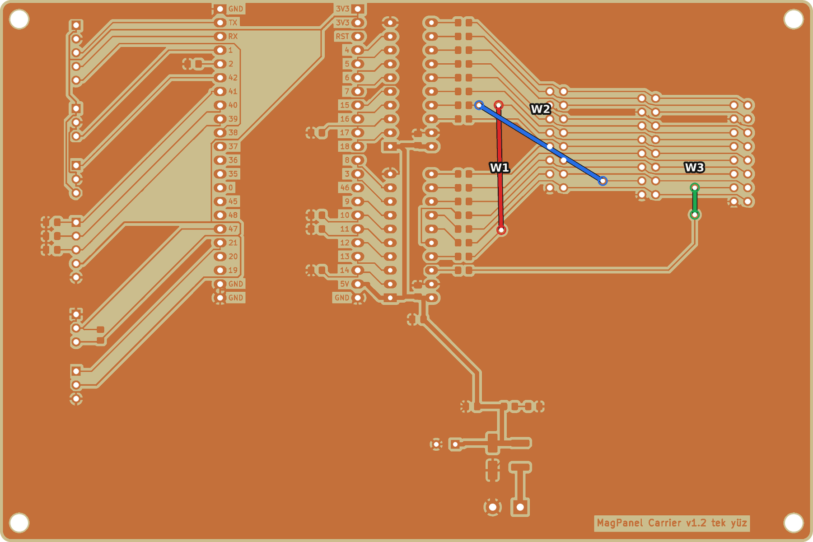
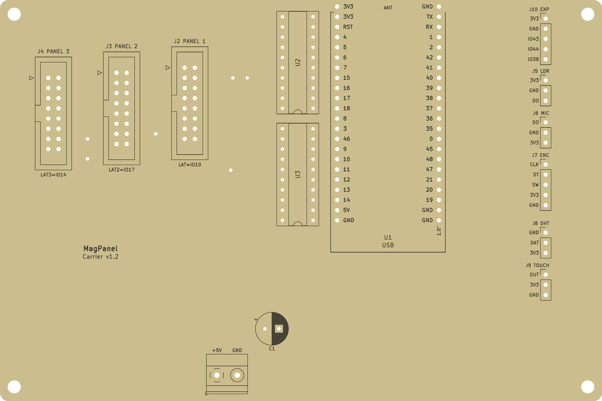

# Tek yüz kart, 150 × 100 mm: Elegoo Saturn 3 Ultra + negatif dry film

Aynı şematiğin tek yüz plaketle yapılan sürümü. Bakır yalnız alt yüzde, kart 150 × 100 mm.
Ayrı KiCad projesidir (`magpanel-carrier-ss/`), çıktılar `fab-ss/` altındadır. Hepsi
`gen_carrier.py --ss` ile üretilir, fabrika ve çift yüz kartın dosyalarına dokunmaz. Pozlama ve
kimya adımları çift yüz kartla aynıdır, ayrıntılar [DIY.md](DIY.md)'de. Bu sayfa farkları anlatır.



| | Çift yüz ev yapımı (`fab-diy/`) | Tek yüz (`fab-ss/`) |
|---|---|---|
| Kart | 100 × 63.5 mm | 150 × 100 mm |
| Plaket | çift yüz | tek yüz, FR4 1.6 mm |
| Pozlama | 2, kart çevrilerek | 1 |
| Tel | 33 via teli | 3 köprü teli, toplam kesim 105 mm |
| Sinyal izi / boşluk | 0.25 / 0.2 mm | 0.25 / 0.25 mm |
| DevKit pin adları | yok | bakır yüzde, soket sıralarının iç tarafında |

## Yerleşim
Soldan sağa: üç HUB75 başlığı (J4 PANEL 3, J3 PANEL 2, J2 PANEL 1), seri 33R sütunu, iki
74HCT245, DevKit, sensör başlıkları. 5 V girişi alt kenarda, klemensin kablosu aşağıdan girer.
DevKit'in altı boştur, USB fişleri takılabilir.



- HUB75 şeridi elle yerleştirilmiş sabit izlerdir. Başlıklar 1.27 mm kademelidir. Şerit üç
  başlıktan pinlerin arasından geçer: 2.54 mm adımlı iki pinin arasından bir iz, iz 0.25 mm, pede
  en az 0.27 mm boşluk. Şeritteki sıra başlığın pin sırasıdır.
- CLK, U3 soketinin içinden dolaşıp sütundaki yerine girer. Bunun için tel gerekmez.
- HUB75 başlıklarının 1 numaralı pedi yuvarlaktır. Kare pedin köşesi şerit izine fazla
  yaklaşıyordu. Pin 1'i başlığın kilit çentiğinden ve üst yüz çiziminden bul.
- Geri kalanı Freerouting çeker, ama yalnız alt katmanı kullanmaya zorlanır. Üst katman
  kullanmak çok pahalıya sayılır. Her deneme KiCad DRC'siyle denetlenir. DRC temiz olanlardan en az
  telli olan kalır.

## DevKit pin adları
Soket sıralarının iç tarafında, her pinin yanında yazılıdır. Adlar modülün üzerindeki baskıyla
aynıdır: GPIO numarası (4, 5, 15 …), TX, RX, 3V3, 5V, GND, RST. Bakır yüzden bakınca düz okunur.
Yazıların çevresi bakırsızdır. Yazı 0.9 mm, çizgi 0.18 mm. İki yazının arasından bir iz geçer.
Aynı adlar üst yüz çiziminde de var.

## Teller
Üç hat tek katmanda yol bulamaz. Üç başlığa giden 13 ortak hat bir şerit oluşturur ve şeritteki
sıra başlık pin sırasıdır. Firmware'in ESP32 pin sırası ise E'yi şeridin altına, LAT2'yi
şeridin içine koyar. LAT2 ve LAT3'ün başlık pinleri de şeridin içinde, CLK ile OE arasında kalır.

| Tel | Hat | Nereden nereye | Düz | Kesim |
|---|---|---|---|---|
| W1 | E (HUB_ADDR_E) | 33R sütununun altı, OE'nin altı → J2'nin önü, B2 ile A arası | 23 mm | 40 mm |
| W2 | LAT2 | 33R sütunu, B2 ile A arası → J2 ile J3 arası | 27 mm | 45 mm |
| W3 | LAT3 | J3 ile J4 arası: şeridin altından CLK ile OE arasına | 5 mm | 20 mm |

Teller bakır yüzdedir ve yalıtımlıdır, uçları tel pedlerine lehimlenir. İletkeni 0.5–0.6 mm
olan tek damarlı tel kullan. Haritadaki çizgi yalnız hangi iki pedin bağlanacağını gösterir. Teli
lehim noktalarının üstünden geçirmeden götür, gerekirse bir damla yapıştırıcıyla sabitle. Kesim
boyu, düz mesafenin 1.3 katı artı iki uç için 10 mm'dir, 5 mm'ye yuvarlanır.

Teller ister parça yüzünden de geçebilir. Tel pedlerini 0.8 mm del ve teli üstten geçir. Altı
pedin hiçbiri bir parçanın altında kalmaz. W2 ise J2 başlığının gövdesinin etrafından dolaşır.

## Dosyalar
| Dosya | İçerik |
|---|---|
| `fab-ss/saturn3/pozlama-testi.goo` | 6 şeritli süre testi: 60, 65 … 85 s |
| `fab-ss/saturn3/alt-60s.goo` … `alt-85s.goo` | bakır + çerçeve + pedlerde matkap merkez noktası, adındaki süre kadar |
| `fab-ss/saturn3/cerceve.goo` | yalnız hizalama çerçevesi, 120 s. Yerleştirmeyi denemek için, şart değil |
| `fab-ss/magpanel-carrier-ss-gerber.zip` | B_Cu, Edge_Cuts (`.gko`), Hizalama, PTH/NPTH delik, B_Mask |
| `fab-ss/magpanel-carrier-ss-teller.pdf` | A4, %100 ölçek: alttan bakış tel haritası, tel listesi, tellerin olduğu bölge büyük |
| `fab-ss/magpanel-carrier-ss-teller.csv` | tel listesi: uçların koordinatı (alttan bakış, sol-alt köşeden), mesafe, kesim |
| `fab-ss/magpanel-carrier-ss-assembly-bottom.pdf` | bakır yüz 1:1, alttan bakış: SMD'ler, izler, tel pedleri |
| `fab-ss/magpanel-carrier-ss-assembly-top.pdf` | parça yüzü 1:1: delikli parçalar, pin adları |
| `fab-ss/magpanel-carrier-ss-bom.csv` | malzeme listesi, çift yüz kartla aynı parçalar |
| `img/ss-bottom.png`, `img/ss-top.png` | görseller |

Her `.goo` dosyasının ilk 2 dakikasında yalnız hizalama çerçevesi yanar. Plaket bu sürede
yerleştirilir, pozlama sonra kendiliğinden başlar. Bakır dosyası testteki altı süre için ayrı ayrı
var: testte en iyi şerit hangisiyse aynı süreli dosyayı bas. Bu filmle Saturn 3 Ultra'da 70–80 s
iyi sonuç veriyor, test bu aralığı ortalar.

Dosyalar Saturn 3 Ultra içindir, başlıktaki makine adı `ELEGOO Saturn 3 Ultra`. Yazıcı başka
modelin dosyasını format hatasıyla reddedebilir. Ekran iki modelde aynıdır. Düz Saturn 3 için
dosyaları `GOO_MACHINE='ELEGOO Saturn 3'` ile yeniden üret (aşağıda).

Kendi pozlama dosyanı UVtools ile yaparsan [DIY.md](DIY.md)'deki tablo geçerli. Alt bakır için
Edge_Cuts.gko, B_Cu.gbl, Hizalama.gbr ve PTH.drl dosyalarını ekle, Mirror kapalı kalsın.

## Yapım
[DIY.md](DIY.md)'deki adımlar, şu farklarla:

1. **Plaket** 150 × 100 mm tek yüz. Eldeki plaket bu ölçüdeyse kesmek gerekmez. Kenarları
   zımparala, bakırı temizle.
2. **Pozlama testi** aynı: `fab-ss/saturn3/pozlama-testi.goo`.
3. **Kâğıtla prova.** Ekrana beyaz kâğıt koy, `alt-60s.goo`'yu bas: 2 dakika çerçeve, sonra
   60 s desen. Desende kart adı ve pin adları **ters** görünmeli: bakır yüz ekrana bakar,
   yukarıdan kartın sırtını görürsün. Çerçeve 157 × 107 mm, ekranın ortasındadır. Ekran
   218.88 × 122.88 mm, yanlarda 31 mm, üstte ve altta 8 mm kalır.
4. **Pozlama.** Tek yüze film lamine et. Testte seçtiğin sürenin dosyasını başlat, örneğin
   `alt-75s.goo`. İlk 2 dakika yalnız çerçeve yanar: plaketi film yüzü aşağıda çerçevenin
   ortasına koy, üstüne cam ve hafif ağırlık. Sonra bakır kendiliğinden pozlanır. Kart çevrilmez.
5. **Banyo, aşındırma, film sökme** aynı. Kontrolde pin adları bakır yüzde düz okunmalı.
6. **Delme.** Bakır yüzden, pedlerin ortasından del:

| Çap | Adet | Nerede |
|---|---|---|
| 0.8 mm | 42 | iki DIP soket, C1 |
| 1.0 mm | 114 | DevKit soketleri, HUB75 başlıkları, sensör başlıkları |
| 1.3 mm | 2 | klemens J1 |
| 3.2 mm | 4 | montaj delikleri |
| 0.8 mm | 6 | tel pedleri, isteğe bağlı |

## Montaj sırası
1. **SMD'ler bakır yüze.** `assembly-bottom.pdf` alttan bakıştır. D1 ve D2'nin katot bandı
   çizimdeki kapalı uca gelir. Kart düz yatarken lehimlemek kolay, bu yüzden ilk iş.
2. **Delikli parçalar** üstten takılır, alttan lehimlenir: DIP soketler, sensör başlıkları,
   HUB75 başlıkları, klemens, C1. DevKit soketleri en son.
3. **Teller**, bakır yüzde, tablodaki gibi.
4. **Ölçüm.** Her telin iki ucu arasında süreklilik olmalı. HUB75 başlıklarında komşu pinler
   arasında kısa devre olmamalı. Sonra [README](README.md)'deki ilk açılış adımları.

PWR LED'i (D2) bakır yüzdedir. Kart DevKit dışarı bakacak şekilde takılırsa LED panele bakar.

## Doğrulama
| Kontrol | Sonuç |
|---|---|
| ERC | 0 bulgu |
| DRC | 0 ihlal, 0 bağlanmamış, 0 şematik farkı |
| Teller | KiCad bağlantı denetimi: üst katman silinip teller iz olarak eklenince 0 bağlanmamış |
| Pozlama dosyaları | UVtools 7.0.1 katman görüntüsünde çerçeve 157.0 × 107.0 mm, ekranın ortasında. Yerleştirme katmanının çerçevesi bakır katmanındakiyle piksel piksel aynı |

Kartın kendisi henüz yapılıp denenmedi. Pozlama süresini önce test şeridiyle bul.

## Yeniden üretmek
```bash
cd hardware/kicad
$PY gen_carrier.py --ss sch     # aynı şematik, ayrı proje
$PY gen_carrier.py --ss pcb     # yerleşim, sabit HUB75 şeridi ve 3 tel, pin adları
$PY gen_carrier.py --ss route   # Freerouting, 6 deneme: DRC temiz olanlardan en az telli kalır
UVTOOLS_CMD=/yol/UVtoolsCmd $PY gen_carrier.py --ss fab
```

- Başka pozlama süreleri: `DIY_EXPOSURE=25` ya da `DIY_EXPOSURE=25,35` ile `fab`. Düz Saturn 3:
  `GOO_MACHINE='ELEGOO Saturn 3'`.

- Freerouting bazen "tamam" der ama çıktı dosyasına birkaç ağı hiç yazmaz. KiCad bunları kopuk
  görür. `route` önce tamamlama turu çalıştırır, yine kopuk kalan denemeyi eler.
- Yerleşim `ss_place()`, sabit izler `ss_hub_tracks()` içindedir. Başlık aralığını ya da
  sütunu değiştirirsen sabit izler kendi kendine uyar. Kontroller yanlış geometride durur.
